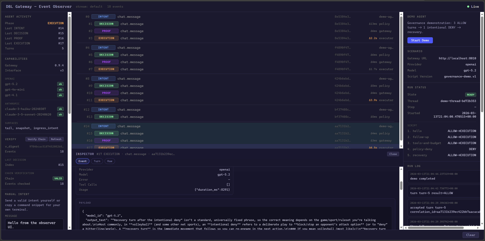

# Observer

The gateway serves a built-in event observer at `/ui` when the active boundary profile is `demo`.

It is a single-file browser surface that consumes the event stream via `/ui/tail`
and keeps all verification logic server-side.

## Layout

- Left: `Agent Activity`, `Capabilities`, `Verify`, `Manual Intent`
- Center: event stream and bottom inspector
- Right: `Demo Agent`

## Stream

The stream groups events by `correlation_id` and shows:

- event kind
- intent type
- correlation id
- actor
- delta time inside a turn

## Inspector

Selecting an event opens the inspector with:

- `Event` view
- `Policy` view for `DECISION` events
- `Turn` view
- `Raw` view

From a selected `DECISION`, the inspector can trigger replay and inspect the
currently loaded policy.

If the loaded policy exposes `describe()`, the inspector renders a structural
tree. If not, it falls back to an `opaque_policy` view with policy id, version,
module, class, and digest so the inspector stays useful for non-structural
policies such as `dbl_policy.allow_all`.

## Verification

In demo mode, the observer uses auth-free proxy routes:

- `GET /ui/snapshot`
- `GET /ui/policy-structure`
- `GET /ui/verify-chain` — compares rolling vs recomputed `v_digest` and reports any `prev_event_digest` chain breaks
- `GET /ui/replay`

The browser never recomputes digests itself. It only triggers and renders
server-side verification results.

## Manual Intent

The `Manual Intent` panel can:

- send a valid minimal envelope through `POST /ui/intent`
- generate valid `curl` and PowerShell examples
- switch between `Minimal` and `Full envelope` snippet views for `/ingress/intent`

This turns the observer into a small execution playground, not just a viewer.
